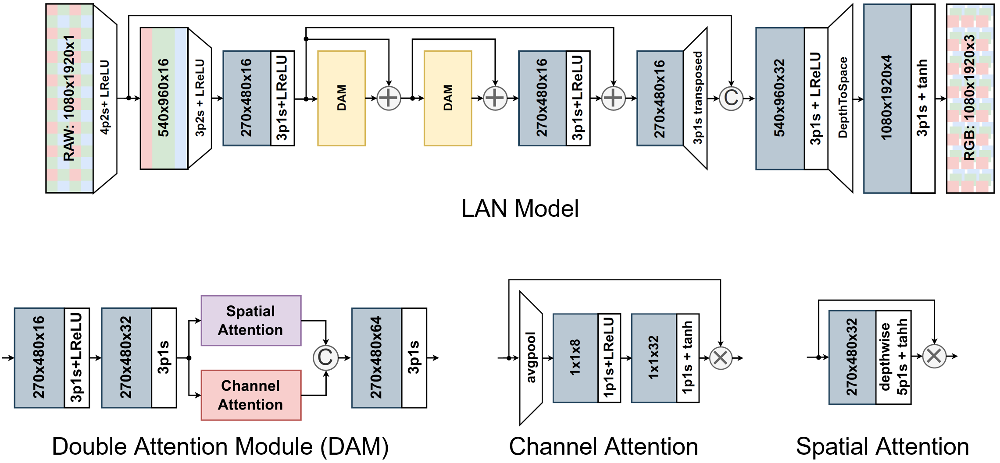

# LAN - Lightweight Attention-based Network for Smartphone Image Processing
## Overview
This repository provides the code used for training and evaluating the LAN CNN. The model was designed to reproduce high-quality RGB images from the Bayer-Filtered RAW output of a smartphone sensor. This can completely replace the hand-crafted Image Signal Processing (ISP) pipelines encountered in digital cameras by a single deep learning model. The model is trained on pairs of images generated with the *Sony IMX586* camera sensor and the *Fujifilm GFX100 DSLR* camera.




## Contents
- [Overview](#overview)
- [Requirements](#requirements)
- [First steps](#first-steps)
- [Training](#training)
- [Inference - Full-Resolution Images](#inference---full-resolution-images)
- [Inference - Numerical Evaluation](#inference---numerical-evaluation)
- [Acknowledgements](#acknowledgements)

## Requirements
- *imageio=2.9.0* for loading .png images
- *numpy=1.21.2* for general matrix operations
- *pillow=8.3.1* for image resizing operations
- *rawpy=0.16.0* for loading .raw images
- *six=1.16.0* for downloads
- *tensorflow-gpu=2.3.0* for the whole NN training and inference
- *tqdm=4.62.1* for nice progress bars

## First steps
- Download the dataset from the **MAI'21 Learned Smartphone ISP Challenge** [website](https://competitions.codalab.org/competitions/28054) (registration needed).
  <sub>The dataset directory (default name: `raw_images/`) should contain three subfolders: `train/`, `val/` and `test/`. </sub>
- Download the pre-trained [VGG-19 model](https://polybox.ethz.ch/index.php/s/7z5bHNg5r5a0g7k) <sup>[Mirror](https://drive.google.com/file/d/0BwOLOmqkYj-jMGRwaUR2UjhSNDQ/view?usp=sharing)</sup> and put it into the `vgg_pretrained/` folder created at the root of the directory.  

## Training
The `train_model.py` file can be invoked as follows:
```bash
python train_model.py <args>
```

where `args` are defined in `utils.py`, and can be one of the following (default values in **```bold```**) :
>```dataset_dir```: **```raw_images/```** &nbsp; - &nbsp; path to the folder with the dataset <br/>
>```vgg_dir```: **```vgg_pretrained/imagenet-vgg-verydeep-19.mat```** &nbsp; - &nbsp; path to the pre-trained VGG-19 network <br/>
>```dslr_dir```: **```fujifilm/```** &nbsp; - &nbsp; path to the folder with the RGB data <br/>
>```phone_dir```: **```mediatek_raw/```** &nbsp; - &nbsp; path to the folder with the Raw data <br/>
>```model_dir```: **```models/```** &nbsp; - &nbsp; path to the folder with the model to be restored or saved <br/>

>```restore_iter```: **```None```** &nbsp; - &nbsp; iteration to restore, defaults to last iteration <br/>
>```patch_w```: **```256```** &nbsp; - &nbsp; width of the training images <br/>
>```patch_h```: **```256```** &nbsp; - &nbsp; height of the training images <br/>

>```batch_size```: **```32```** &nbsp; - &nbsp; batch size [small values can lead to unstable training] <br/>
>```train_size```: **```5000```** &nbsp; - &nbsp; the number of training patches randomly loaded each 1000 iterations <br/>
>```learning_rate```: **```5e-5```** &nbsp; - &nbsp; learning rate <br/>
>```eval_step```: **```1000```** &nbsp; - &nbsp; each ```eval_step``` iterations the accuracy is computed and the model is saved <br/>
>```num_train_iters```: **```100000```** &nbsp; - &nbsp; the number of training iterations <br/>
>```optimizer```: **```radam```** &nbsp; - &nbsp; the optimizer used (```adam``` is the other option) <br/>

the loss function can also be built with the following losses:
>```fac_mse```: **```0```** &nbsp; - &nbsp; Mean-Squared-Error <br/>
>```fac_l1```: **```0```** &nbsp; - &nbsp; Mean-Absolute-Error <br/>
>```fac_ssim```: **```0```** &nbsp; - &nbsp; Structural Similarity Index <br/>
>```fac_ms_ssim```: **```30```** &nbsp; - &nbsp; Multi-Scale Structural Similarity Index <br/>
>```fac_uv```: **```100```** &nbsp; - &nbsp; Loss between blurred UV channels (color loss) <br/>
>```fac_vgg```: **```0```** &nbsp; - &nbsp; VGG loss (perceptual loss) <br/>
>```fac_lpips```: **```10```** &nbsp; - &nbsp; LPIPS loss (perceptual loss) <br/>
>```fac_huber```: **```300```** &nbsp; - &nbsp; Huber loss <br/>
>```fac_charbonnier```: **```0```** &nbsp; - &nbsp; Charbonnier loss (approximation of L1 loss) <br/>

## Inference - Full-Resolution Images
The `test_model.py` file can be invoked as follows:
```bash
python test_model.py <args>
```
where `args` are defined in `utils.py`, and can be one of the following (default values in **```bold```**) :
>```dataset_dir```: **```raw_images/```** &nbsp; - &nbsp; path to the folder with the dataset <br/>
>```result_dir```: **```<model_dir>```** &nbsp; - &nbsp; output images are saved under ```results/full-resolution/<result_dir>``` <br/>
>```phone_dir```: **```mediatek_raw_normal/```** &nbsp; - &nbsp; path to the folder with the Raw data <br/>
>```model_dir```: **```models/```** &nbsp; - &nbsp; path to the folder with the model to be restored or saved <br/>

>```restore_iter```: **```None```** &nbsp; - &nbsp; iteration to restore, defaults to last iteration <br/>
>```img_w```: **```3000```** &nbsp; - &nbsp; width of the full-resolution images <br/>
>```img_h```: **```4000```** &nbsp; - &nbsp; height of the full-resolution images <br/>
>```use_gpu```: **```True```** &nbsp; - &nbsp; use the GPU for inference <br/>

## Inference - Numerical Evaluation
The `evaluate_model.py` file can be invoked as follows:
```bash
python evaluate_model.py <args>
```
where `args` are defined in `utils.py`, and can be one of the following (default values in **```bold```**) :
>```dataset_dir```: **```raw_images/```** &nbsp; - &nbsp; path to the folder with the dataset <br/>
>```vgg_dir```: **```vgg_pretrained/imagenet-vgg-verydeep-19.mat```** &nbsp; - &nbsp; path to the pre-trained VGG-19 network <br/>
>```dslr_dir```: **```fujifilm/```** &nbsp; - &nbsp; path to the folder with the RGB data <br/>
>```phone_dir```: **```mediatek_raw/```** &nbsp; - &nbsp; path to the folder with the Raw data <br/>
>```model_dir```: **```models/```** &nbsp; - &nbsp; path to the folder with the model to be restored or saved <br/>

>```restore_iter```: **```None```** &nbsp; - &nbsp; iteration to restore, defaults to last iteration <br/>
>```img_w```: **```256```** &nbsp; - &nbsp; width of the evaluation patches <br/>
>```img_h```: **```256```** &nbsp; - &nbsp; height of the evaluation patches <br/>
>```use_gpu```: **```True```** &nbsp; - &nbsp; use the GPU for inference <br/>
>```batch_size```: **```10```** &nbsp; - &nbsp; batch size <br/>

## Acknowledgements
- This repo bases on the [mai21-learned-smartphone-isp](https://github.com/MediaTek-NeuroPilot/mai21-learned-smartphone-isp) repository;
- The LPIPS loss function was implemented using the code from [alexlee-gk](https://github.com/alexlee-gk/lpips-tensorflow);
- The RAdam optimizer was implemented using the code from [taki0112](https://github.com/taki0112/RAdam-Tensorflow).